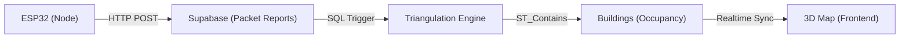

# Buckeye-Sense: Hardware Integration Guide

This guide provides the technical specifications for connecting physical sensor nodes (ESP32) to the **Buckeye-Sense Real-time Map**.

## 📡 The Data Flow


## ⚙️ Board Configuration
Each ESP32 unit must be configured with its own `board_id` (e.g., `board_north`, `board_south`) which corresponds to the coordinates seeded in your `boards` table in Supabase.

### Recommended Node Placement
To achieve accurate triangulation, place your nodes in a triangle around the target area (e.g., Fontana Labs).
- **Node A**: North Corner
- **Node B**: East Corner
- **Node C**: West Corner

## 🔐 API Authentication & Endpoint
The Arduino must send the following headers with every request:
- **Endpoint**: `https://[YOUR_PROJECT_REF].supabase.co/rest/v1/packet_reports`
- **Headers**:
    - `apikey`: Your Supabase **Anon Key**
    - `Authorization`: `Bearer [Anon Key]`
    - `Content-Type`: `application/json`

## 📦 Payload Specification
The ESP32 should send a JSON payload whenever a packet is detected in monitor mode.

```json
{
  "packet_id": "pkt_B0B867CFF802_1710200300", 
  "board_id": "board_north",
  "device_hash": "a1b2c3d4e5f6...",
  "arrival_time_us": 1710200300000000,
  "rssi": -65,
  "esp_timestamp_ms": 123456,
  "esp_report_ms": 7890
}
```

### Critical Rules for Accuracy
1. **Deduplication**: Use a combination of `MAC + Sequence Number` (or Timestamp) to create a unique `packet_id`. This ensures the backend knows multiple nodes saw the same physical packet.
2. **Synchronization**: Boards should use NTP to ensure `arrival_time_us` is relatively synchronized across nodes.
3. **Anonymization**: **NEVER** send raw MAC addresses. Hash them locally on the ESP32 before transmission to protect privacy.
4. **MAC Isolation**: You can isolate logging to a specific device by using the `set_focused_mac()` RPC in Supabase.

## 🛠️ Testing your Integration
Test your API setup using `curl` before writing C++:

```bash
curl -X POST "https://your-project.supabase.co/rest/v1/packet_reports" \
-H "apikey: your-anon-key" \
-H "Authorization: Bearer your-anon-key" \
-H "Content-Type: application/json" \
-d '{
  "packet_id": "test_pkt_001",
  "board_id": "board_north",
  "device_hash": "mock_device",
  "arrival_time_us": 1710200300000,
  "rssi": -50
}'
```
