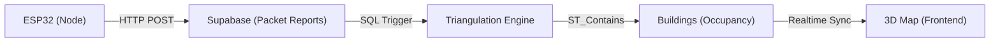

# Arduino/ESP32 Integration Walkthrough

This guide provides the technical specifications for connecting physical sensor nodes (ESP32) to the **MakeOhio26 Real-time Map**.

---

## 📡 The Data Flow


---

## ⚙️ Board Configuration
Each ESP32 unit must be configured with its own `board_id` (e.g., `board_north`, `board_south`) which corresponds to the coordinates seeded in your `boards` table in Supabase.

### Recommended Node Placement
To achieve accurate triangulation, place your nodes in a triangle around the target buildings.
- **Node A**: Near Scott House
- **Node B**: Near Jones Tower
- **Node C**: Near Fontana Labs

---

## 🔐 API Authentication
The Arduino must send the following headers with every request:
- `apikey`: Your Supabase **Anon Key**
- `Authorization`: `Bearer [Anon Key]`
- `Content-Type`: `application/json`

> [!TIP]
> You can find these values in your `.env` file under `VITE_SUPABASE_ANON_KEY`.

---

## 📦 Payload Specification
The ESP32 should send a JSON payload whenever a packet is detected in monitor mode.

```json
{
  "packet_id": "pkt_1710200300_hash", 
  "board_id": "board_north",
  "device_hash": "a1b2c3d4e5f6...",
  "arrival_time_us": 1710200300000000,
  "rssi": -65
}
```

### Critical Rules for Accuracy
1. **Deduplication**: Use a combination of `MAC + Sequence Number` to create the `packet_id`. This ensures our backend knows that three nodes saw the same physical packet.
2. **Synchronization**: Boards should ideally have synchronized clocks (via NTP) to make `arrival_time_us` accurate for future TDOA implementation.
3. **Anonymization**: **NEVER** send raw MAC addresses. Hash them locally on the ESP32 before transmission to protect student privacy.

---

## 🛠️ Testing your Integration
You can test your API setup using `curl` before writing any C++ code:

```bash
curl -X POST "https://your-project.supabase.co/rest/v1/packet_reports" \
-H "apikey: your-anon-key" \
-H "Authorization: Bearer your-anon-key" \
-H "Content-Type: application/json" \
-d '{
  "packet_id": "test_packet_001",
  "board_id": "board_north",
  "device_hash": "mock_device_user",
  "arrival_time_us": 1710200300000,
  "rssi": -50
}'
```
